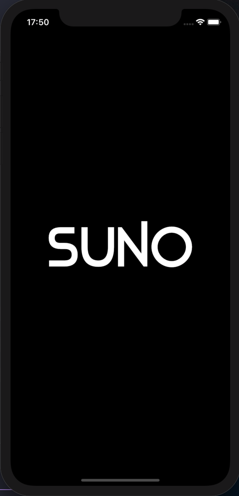
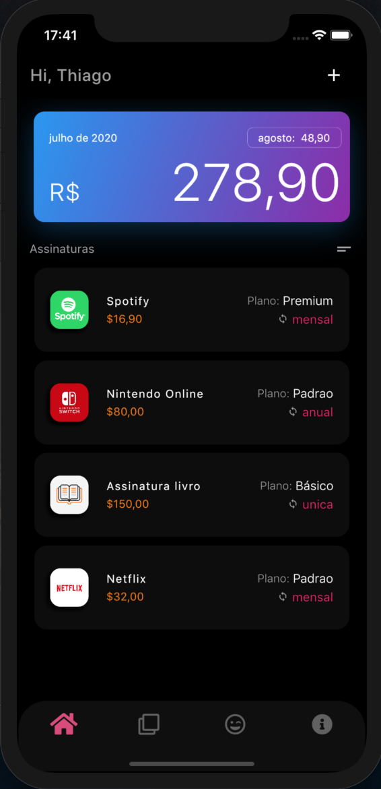
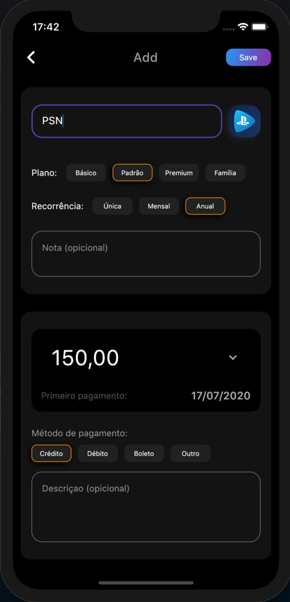
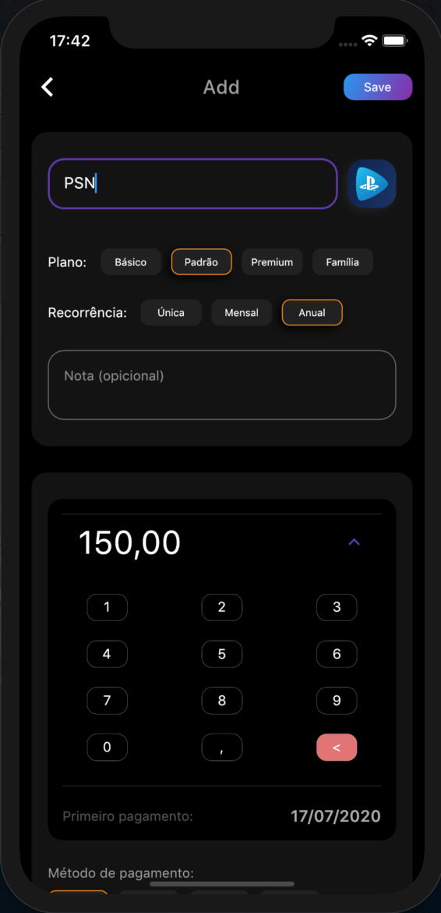
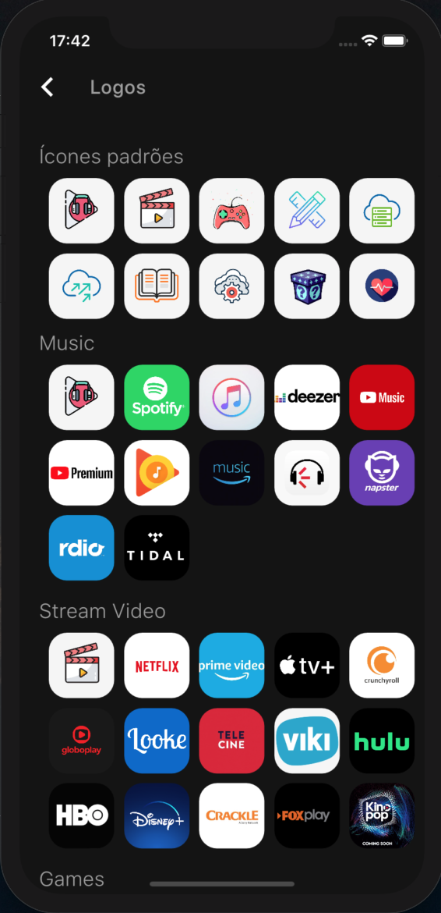
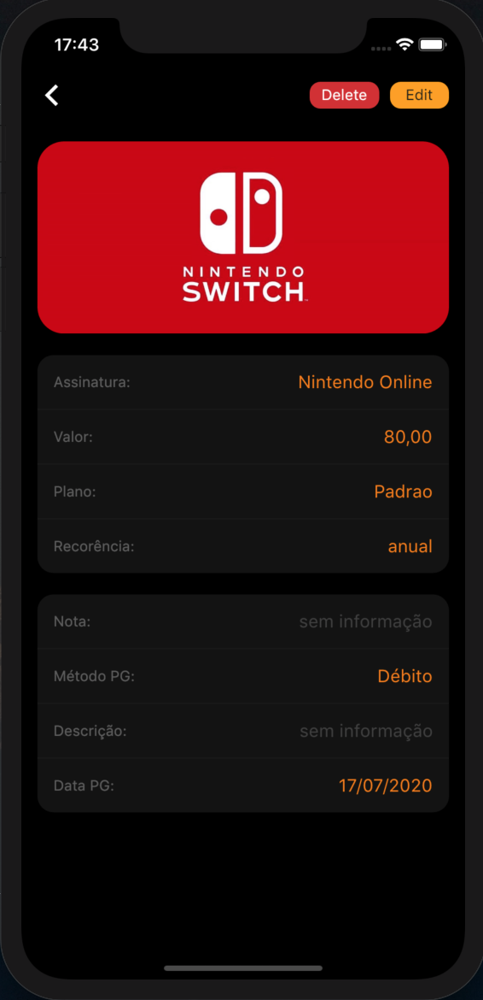
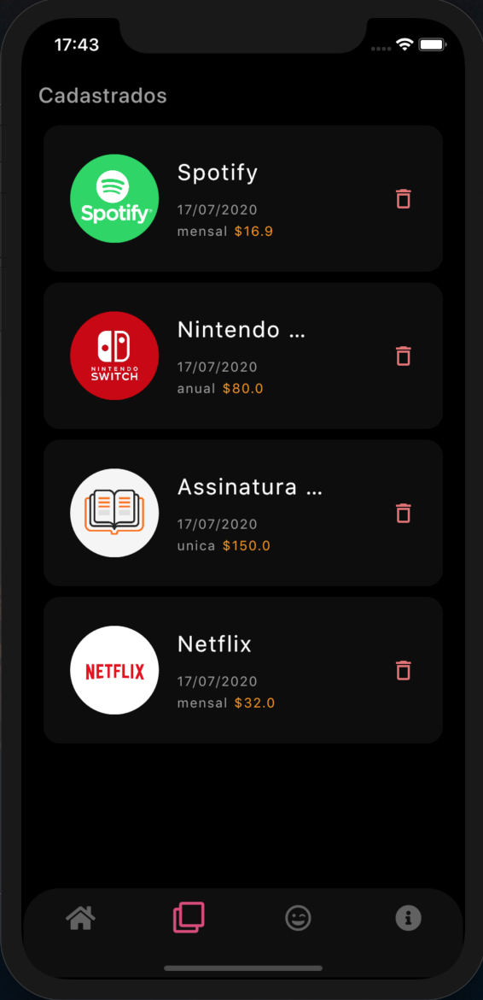
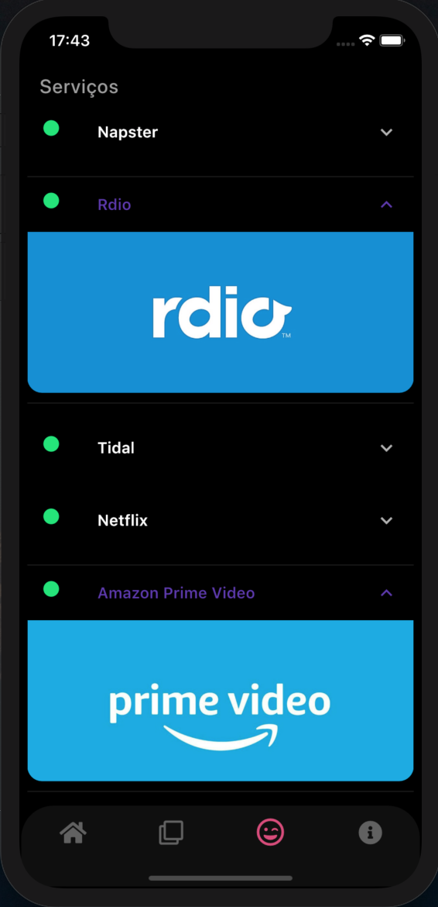
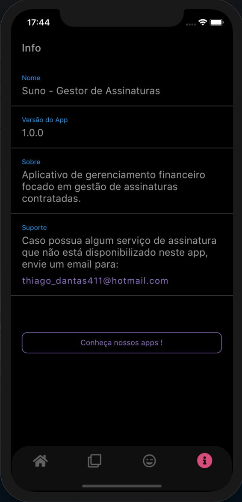
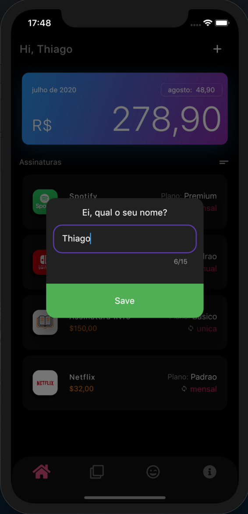

# Suno - Gestor de Assinaturas
 
App pensado para ter uma UI amigável e convidativa, com o intuito de fornecer um maior controle sobre os serviços de assinaturas mais utilizados,
podendo ser pagamento único, mensal ou anual. Também pode-se categorizar por tipo de plano (básico, padrão, premium e família).

Assim o usuário terá um conrole sobre o valor, a recorrência e o tipo de plano contratado logo na tela inicial do app(imagem 2).

 

 ## Video Demonstrativo -> [Clique aqui](https://youtu.be/KplxbhvhmD8)
 

 

 ## Screens

 
 
 
 
 
 
 
 

 
 

 
 
  
 
 
 
 
 

 

 ## O App aborda:

    • UI própria
  
    • Widgets customizados (ex: Teclado numérico, imagem 4)
    
    • SharedPreferences
  
    • SqFlite (persistência de dados)
  
    • Lógica para lançamentos únicos, mensais e anuais.
    
    • Cálculo de gastos para o mês atual e o mês seguinte.
    
    • Hero Animation
    
    • Splash Screen
    
    
